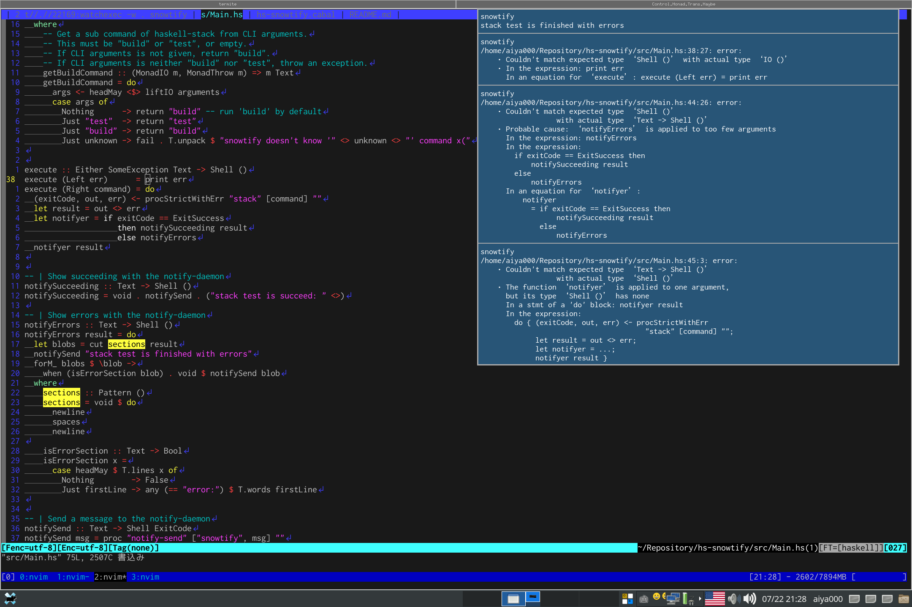

# :snowman: hs-snowtify :snowman:
snowtify send your result of `stack build` (`stack test`) to notify-daemon :dog2:




# :notes: Usage :notes:
```console
$ snowtify test
(`stack test` results is shown, it is like above screenshot)
$ snowtify build
(same as snowtify test, but stack build is executed)
```


# :muscle: Example :muscle:
```console
$ dunst &
(dunst is a notify-daemon)
$ cd <some haskell project directory>
$ watchexec -w . 'snotify test'
(`stack test` results is shown after you update some file)
```
